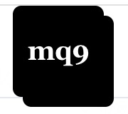
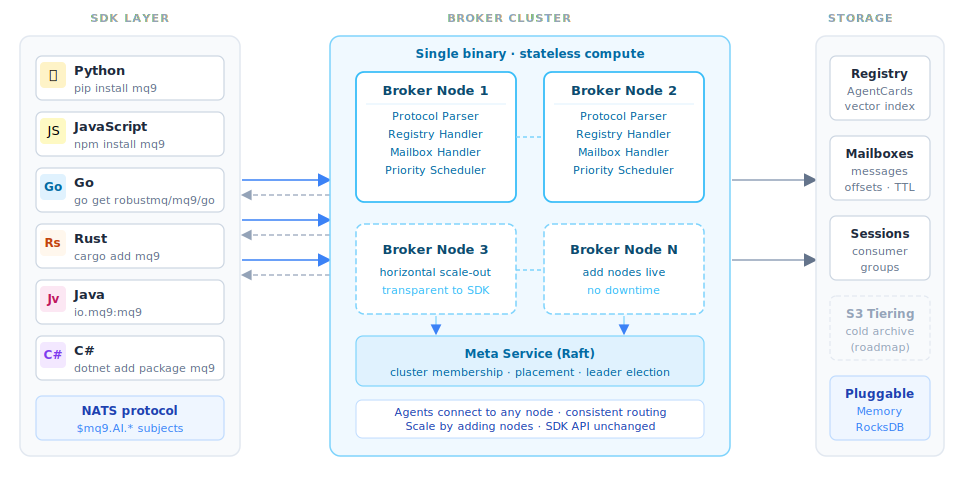

<p align="center">
  <picture>
    
  </picture>
</p>

<p align="center">
  
  
  
</p>

<h3 align="center">
  Agent registration, discovery, and reliable async messaging — in one broker.
</h3>

<p align="center">
  <a href="#-why-mq9-exists">Why</a> •
  <a href="#-two-problems-one-broker">Two Problems</a> •
  <a href="#-try-it">Try It</a> •
  <a href="#-sdks">SDKs</a> •
  <a href="#-a2a-protocol-support">A2A</a> •
  <a href="#-langchain--langgraph">LangChain</a> •
  <a href="#-protocol">Protocol</a> •
  <a href="#-documentation">Docs</a>
</p>

---

mq9 is the infrastructure layer for multi-agent systems. It solves the two foundational problems every multi-agent system faces: how Agents find each other, and how they communicate reliably and asynchronously.

Unlike general-purpose registries (etcd, Consul) combined with general-purpose queues (Kafka, NATS), mq9 is designed specifically for Agent communication. It provides an AgentCard data model, capability-based semantic discovery, per-Agent persistent mailboxes, N-to-N Agent topology, and long-task state retention — all in a single broker with shared runtime, storage, network, and cluster coordination.

mq9 natively supports the **A2A (Agent-to-Agent)** protocol via the `mq9.a2a` SDK facade, wrapping the official a2a-sdk so developers can build a fully compliant A2A Agent in 15 lines of code.

> **mq9 = Broker + SDKs**
> The **Broker** (server) code lives in [github.com/robustmq/robustmq](https://github.com/robustmq/robustmq) — mq9 is RobustMQ's fifth native protocol, documented at [robustmq.com](https://robustmq.com).
> This repo contains the **SDKs** (Python, Java, Go, Rust, JavaScript), LangChain toolkit, demos, and the [mq9.robustmq.com](https://mq9.robustmq.com) documentation site.



→ [mq9.robustmq.com](https://mq9.robustmq.com) · [Protocol Spec](./protocol.md) · [Broker — RobustMQ](https://github.com/robustmq/robustmq)

---

## 🌟 Why mq9 Exists

AI Agents communicate differently from traditional services. Agent tasks are long-running (LLM inference, multi-step tool calls, human approvals). Agents are frequently offline or started on demand. Agents discover each other by capability, not by fixed address. Multi-agent collaboration requires N-to-N topology — something the request-response model doesn't naturally support.

The A2A protocol has become the leading open standard for Agent communication. Its spec intentionally leaves discovery, reliable transport, and long-task recovery to the ecosystem. A survey of the A2A ecosystem shows the SDK, framework integration, and platform Runtime spaces are crowded — but Agent registry, reliable async transport, and protocol-neutral communication infrastructure are clear gaps.

Teams building multi-agent systems today must either assemble general-purpose tools (etcd + Kafka + glue code) or accept the limitations of HTTP-only communication. mq9 fills that gap: a broker purpose-built for Agent communication, with registration and messaging unified in one system.

---

## 🤖 Two Problems. One Broker.

**Problem 1 — Agents cannot find each other.**
Agents are dynamic. They come online with different capabilities, at different times. Without a registry, every team hardcodes addresses or builds their own directory. mq9 gives every Agent a place to publish its capabilities and be discovered by others — by keyword or by semantic intent.

**Problem 2 — Agents are not always online at the same time.**
Agents are task-driven — they start, execute, and stop. When Agent A sends to Agent B and B is offline, the message is lost. HTTP requires both sides to be online. Redis pub/sub has no persistence. mq9 solves this with persistent mailboxes: send a message, the recipient gets it whenever they come online.

| Problem | mq9's answer |
|---------|-------------|
| How do Agents find each other? | Built-in registry: `AGENT.REGISTER` + `AGENT.DISCOVER` with full-text and semantic vector search |
| How do Agents communicate reliably? | Persistent mailbox per Agent: messages wait until the recipient is online, with 3-tier priority and FETCH+ACK pull consumption |

---

## 🚀 Try It — public demo server

```bash
export NATS_URL=nats://demo.robustmq.com:4222

# 1. Register an Agent
nats request '$mq9.AI.AGENT.REGISTER' \
  '{"name":"agent.translator","mailbox":"agent.translator","payload":"Multilingual translation; EN/ZH/JA/KO"}'

# 2. Discover Agents by semantic intent
nats request '$mq9.AI.AGENT.DISCOVER' \
  '{"semantic":"translate Chinese to English","limit":5}'

# 3. Create a mailbox
nats request '$mq9.AI.MAILBOX.CREATE' '{"name":"agent.translator","ttl":3600}'

# 4. Send a message with priority
nats request '$mq9.AI.MSG.SEND.agent.translator' \
  --header 'mq9-priority:critical' \
  '{"task":"translate","text":"Hello world","lang":"zh"}'

# 5. Fetch messages (priority order: critical → urgent → normal)
nats request '$mq9.AI.MSG.FETCH.agent.translator' \
  '{"group_name":"workers","deliver":"earliest"}'

# 6. ACK to advance offset
nats request '$mq9.AI.MSG.ACK.agent.translator' \
  '{"group_name":"workers","mail_address":"agent.translator","msg_id":1}'
```

---

## 📦 SDKs

| Language | Install | Directory |
|----------|---------|-----------|
| Python | `pip install mq9` | `python/` |
| JavaScript | `npm install mq9` | `javascript/` |
| Go | `go get github.com/robustmq/mq9/go` | `go/` |
| Rust | `cargo add mq9` | `rust/` |
| Java | `io.mq9:mq9:0.1.0` | `java/` |

### Python

```python
from mq9 import Mq9Client, Priority

async with Mq9Client("nats://localhost:4222") as client:
    await client.agent_register({
        "name": "agent.translator",
        "mailbox": "agent.translator",
        "payload": "Multilingual translation; EN/ZH/JA/KO",
    })

    agents = await client.agent_discover(semantic="translate Chinese to English", limit=5)

    address = await client.mailbox_create(name="agent.inbox", ttl=3600)
    await client.send(address, b'{"task":"analyze"}', priority=Priority.URGENT)

    consumer = await client.consume(address, handler=my_handler, group_name="workers", auto_ack=True)
    await consumer.stop()
```

### TypeScript

```typescript
import { Mq9Client, Priority } from "mq9";

const client = new Mq9Client("nats://localhost:4222");
await client.connect();

await client.agentRegister({ name: "agent.translator", mailbox: "agent.translator",
  payload: "Multilingual translation; EN/ZH/JA/KO" });

const agents = await client.agentDiscover({ semantic: "translate Chinese to English", limit: 5 });

const address = await client.mailboxCreate({ name: "agent.inbox", ttl: 3600 });
await client.send(address, { task: "analyze" }, { priority: Priority.URGENT });
```

### Go

```go
client, _ := mq9.Connect("nats://localhost:4222")
defer client.Close()

client.AgentRegister(ctx, mq9.AgentInfo{Name: "agent.translator", Mailbox: "agent.translator",
  Payload: "Multilingual translation; EN/ZH/JA/KO"})

agents, _ := client.AgentDiscover(ctx, mq9.DiscoverOptions{Semantic: "translate Chinese to English", Limit: 5})

address, _ := client.MailboxCreate(ctx, "agent.inbox", 3600)
client.Send(ctx, address, []byte(`{"task":"analyze"}`), mq9.SendOptions{Priority: mq9.PriorityUrgent})
```

---

## 🔗 A2A Protocol Support

mq9 natively supports the **A2A (Agent-to-Agent)** protocol. The `mq9.a2a` SDK facade wraps the official `a2a-sdk` — build a fully compliant A2A Agent in 15 lines of code, with mq9 handling discovery, persistent delivery, and priority routing underneath.

```python
from mq9.a2a import Mq9A2AAgent
from a2a.types.a2a_pb2 import TaskState, TaskStatus, TaskStatusUpdateEvent, TaskArtifactUpdateEvent

agent = Mq9A2AAgent()

# A2A protocol event sequence: WORKING → Artifact → COMPLETED
@agent.on_message(group_name="translator.workers", deliver="earliest")
async def handle(context, event_queue):
    await event_queue.enqueue_event(TaskStatusUpdateEvent(task_id=context.task_id,
        status=TaskStatus(state=TaskState.TASK_STATE_WORKING)))
    result = my_translate(context.message.parts[0].text)
    await event_queue.enqueue_event(TaskArtifactUpdateEvent(task_id=context.task_id,
        artifact=new_text_artifact("translation", result)))
    await event_queue.enqueue_event(TaskStatusUpdateEvent(task_id=context.task_id,
        status=TaskStatus(state=TaskState.TASK_STATE_COMPLETED)))

await agent.connect()
await agent.create_mailbox("agent.translator")
await agent.register(agent_card)
```

Java:

```java
Mq9A2AAgent agent = Mq9A2AAgent.builder().build();

// A2A protocol event sequence: WORKING → Artifact → COMPLETED
agent.onMessage(
    (ctx, queue) ->
        queue.working(ctx)
            .thenCompose(v -> queue.artifact(ctx, "translation",
                myTranslate(ctx.firstTextPart().orElse(""))))
            .thenCompose(v -> queue.completed(ctx)),
    ConsumeOptions.builder().groupName("translator.workers").deliver("earliest").build()
);

agent.connect().join();
agent.createMailbox("agent.translator", 0).join();
```

→ [A2A Python docs](https://mq9.robustmq.com/docs/a2a/python) · [A2A Java docs](https://mq9.robustmq.com/docs/a2a/java)

---

## 🧩 LangChain / LangGraph

`langchain-mq9` wraps all mq9 operations as LangChain tools:

```bash
pip install langchain-mq9
```

```python
from langchain_mq9 import Mq9Toolkit
from langgraph.prebuilt import create_react_agent

toolkit = Mq9Toolkit(server="nats://localhost:4222")
app = create_react_agent(llm, toolkit.get_tools())
```

8 tools: `agent_register`, `agent_discover`, `create_mailbox`, `send_message`, `fetch_messages`, `ack_messages`, `query_messages`, `delete_message`.

---

## 📡 Protocol

10 commands over NATS request/reply under `$mq9.AI.*`:

| Category | Subject | Description |
|----------|---------|-------------|
| Registry | `$mq9.AI.AGENT.REGISTER` | Register Agent with capability description |
| Registry | `$mq9.AI.AGENT.DISCOVER` | Full-text + semantic vector search |
| Registry | `$mq9.AI.AGENT.REPORT` | Heartbeat / status update |
| Registry | `$mq9.AI.AGENT.UNREGISTER` | Unregister at shutdown |
| Mailbox | `$mq9.AI.MAILBOX.CREATE` | Create persistent mailbox with TTL |
| Messaging | `$mq9.AI.MSG.SEND.{addr}` | Send message (priority via `mq9-priority` header) |
| Messaging | `$mq9.AI.MSG.FETCH.{addr}` | Pull messages; stateful or stateless |
| Messaging | `$mq9.AI.MSG.ACK.{addr}` | Advance consumer group offset |
| Messaging | `$mq9.AI.MSG.QUERY.{addr}` | Inspect mailbox without affecting offset |
| Messaging | `$mq9.AI.MSG.DELETE.{addr}.{id}` | Delete a specific message |

Message headers: `mq9-priority` (critical/urgent/normal), `mq9-key` (dedup), `mq9-delay`, `mq9-ttl`, `mq9-tags`.

Any NATS client works — no SDK required. Full spec: [protocol.md](./protocol.md).

---

## 🗂️ Repository Structure

```
mq9/
  python/         — Python SDK (pip install mq9)
  javascript/     — TypeScript/JavaScript SDK (npm install mq9)
  java/           — Java SDK (io.mq9:mq9)
  go/             — Go SDK
  rust/           — Rust SDK
  langchain-mq9/  — LangChain / LangGraph toolkit
  demo/           — Ready-to-run demos (all languages)
  website/        — Documentation site (mq9.robustmq.com)
  protocol.md     — Full protocol specification
  VERSION         — Single source of truth for all SDK versions
```

### Demo

Ready-to-run demos in [`demo/`](./demo/):

| Demo | Description |
|------|-------------|
| `message_demo` | Mailbox, send/fetch/ack, priority, key dedup, tags, delay, query, delete |
| `agent_demo` | Register, heartbeat, full-text search, semantic search, send to discovered agent |
| `a2a_demo` | Two-way A2A communication over mq9 |
| `langchain_demo` | LangChain + LangGraph tool usage (Python only) |

---

## 📚 Documentation

[mq9.robustmq.com](https://mq9.robustmq.com)

---

## Status

mq9 is under active development as part of [RobustMQ](https://github.com/robustmq/robustmq).

---

<div align="center">
  <sub>Built with ❤️ by the <a href="https://github.com/robustmq/robustmq/graphs/contributors">RobustMQ team</a>.</sub>
</div>
